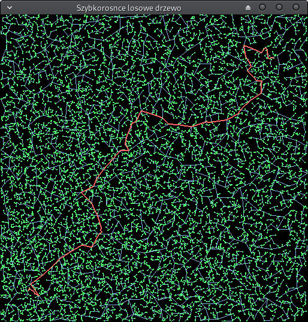
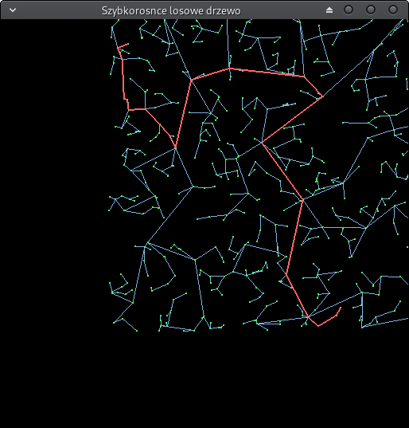
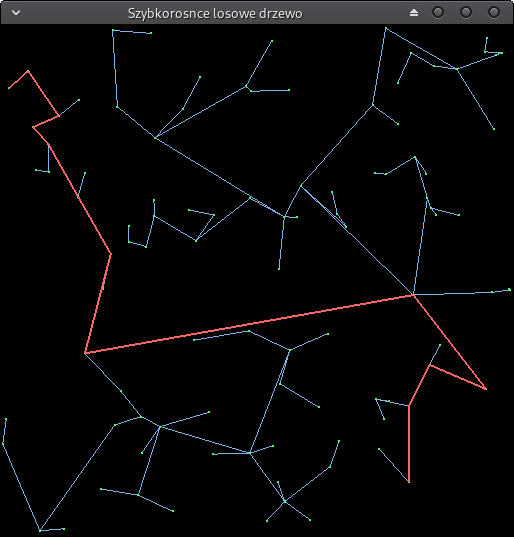
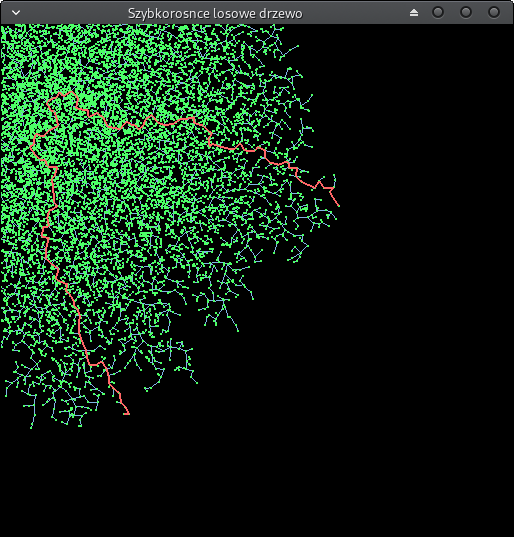

# RRT

Rapidly exploring random tree. 

Example usage (use only numbers, default values provided):
```
./rrt [max branch length=0.05] [number of nodes=10000]
```

Supported controls:
- Q - select first node
- W - select last node
- Mouse scroll - zoom view
- Left mouse button - pan view

Dependencies:
- [SFML](https://www.sfml-dev.org/) - window creation, input handling
- [glm](https://glm.g-truc.net/0.9.9/index.html) - matrix math





